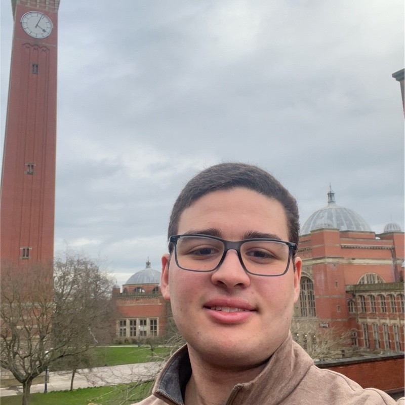

# Personal Portfolio Website

A portfolio website showcasing my skills, projects, and professional information as an AI and Computer Science student.

## 🚧 Project Status: In Development

This portfolio website is currently under active development. Features and content are being added and refined.

## Features (In Progress)

- Responsive design for all devices
- Dark/Light mode toggle
- Interactive elements and animations
- Contact form with EmailJS integration
- Project showcase with downloadable certificates
- Skills visualization
- Education timeline

## Technologies Used

- HTML5
- CSS3
- JavaScript
- EmailJS
- Font Awesome
- Google Fonts

## Getting Started

1. Clone the repository
2. Open `index.html` in your browser or use a local server
3. Explore the website

## Contact

Ramy Mekhzer - [mekhzerramy@gmail.com](mailto:mekhzerramy@gmail.com)

---

*This project is a work in progress. More details will be added as development continues.* 